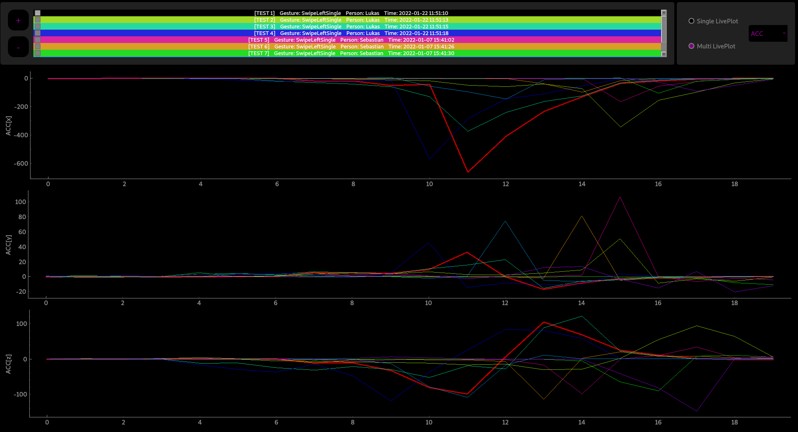

# CSV Plot App

Plotting Data out of a Csv File with the Template of data in a data_template.json
- data_template.json has to be in lib folder of working directory ???

"TestData" contains with "gyro-to-sd" recorded tests. 
"lib/Widgets" contains the defined widgets for showing.
"lib/PlotDataStrategy" contains the functions for transforming CSV data objects into  a readable correct format.

...
...
...

## Examples
### Single Plot

### Multi Plot
